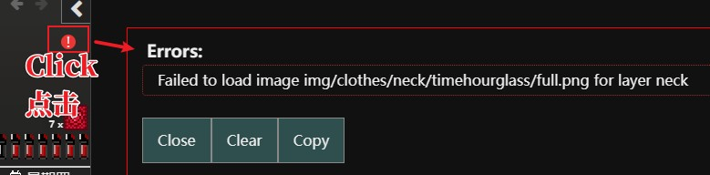

# ModLoader DoL ImageLoaderHook

---

## 💡 请各位Mod开发者注意
由于当前社区中出现了大量的美化和特写Mod，为了避免在安装多套美化Mod时出现同路径图片冲突导致大量报黄色警告的问题，
请还在使用本Addon的开发者尽可能迁移到新的`BeautySelectorAddon`上，
本Mod将在未来的某个时间被标注为Deprecate并对仍然默认使用本Addon的Mod默认报黄色警告。

如没有特殊需求，请尽可能使用新的[BeautySelectorAddon](https://github.com/Lyoko-Jeremie/DoL_BeautySelectorAddonMod) 。

对于已经在开发中的Mod，您可以使用`BeautySelectorAddon`的`模式0`。简单地替换`addonPlugin`中的`ImageLoaderAddon`声明到`BeautySelectorAddon`即可。   
对于新建立的Mod，您可以使用`BeautySelectorAddon`的`模式1`。   

## 💡 Please note for Mod developers

Due to the emergence of a large number of beautification and close-up Mods in the current community,
to avoid the issue of numerous yellow warnings caused by conflicts of same-path images when installing multiple beautification Mods,
developers still using this Addon are requested to migrate to the new BeautySelectorAddon as much as possible.
This Mod will be marked as Deprecated at some point in the future,
and Mods that still default to using this Addon will receive yellow warnings by default.

If there is no special requirement, please use the new [BeautySelectorAddon](https://github.com/Lyoko-Jeremie/DoL_BeautySelectorAddonMod) as much as possible.

For Mods that are already in development, you can use `type 0` of `BeautySelectorAddon`. Simply replace the `ImageLoaderAddon` declaration in `addonPlugin` with `BeautySelectorAddon`.   
For newly created Mods, you can use `type 1` of `BeautySelectorAddon`.   


### 如何迁移到`BeautySelectorAddon` How to migrate to `BeautySelectorAddon`

```json lines
{
  "imgFileList": [
    // 保持不变
    // keep it
    "img/.........png",
  ],
  "addonPlugin": [
    // 删掉`ImageLoaderAddon`的声明
    // delete `ImageLoaderAddon`'s declaration
//    {
//      "modName": "ModLoader DoL ImageLoaderHook",
//      "addonName": "ImageLoaderAddon",
//      "modVersion": "^2.3.0",
//      "params": [
//      ]
//    },
    {
      // 添加`BeautySelectorAddon`的声明
      // add `BeautySelectorAddon`'s declaration
      "modName": "BeautySelectorAddon",
      "addonName": "BeautySelectorAddon",
      "modVersion": "^2.0.0",
      "params": {
        // 给你的图片集起一个美化类型的名字，如果想不到，就用Mod的名字吧
        // 请注意，这个名字必须是唯一的，不能和其他Mod的美化的类型名字重复
        // given a name for your beauty type, if you can't think of it, just use the name of your Mod
        // please note that this name must be unique and cannot be the same as the name of the beauty type of other Mods
        "type": "YourBeautyType1",
      }
    }
  ],
  "dependenceInfo": [
    // 删掉`ImageLoaderAddon`的声明
    // delete `ImageLoaderAddon`'s declaration
//    {
//      "modName": "ModLoader DoL ImageLoaderHook",
//      "version": "^2.3.0"
//    },
    // 添加`BeautySelectorAddon`的声明
    // add `BeautySelectorAddon`'s declaration
    {
      "modName": "BeautySelectorAddon",
      "version": "^2.0.0"
    }
  ]
}
```


---

---

---


## 以下是 `ImageLoaderHook` 的使用说明 Here is the usage of `ImageLoaderHook`

```json lines
{
  "imgFileList": [
    // place your image file here
    "img/xxx/aaa/bbb/ccc.png",
    "img/xxx/111/222/333.png"
  ],
  "addonPlugin": [
    // simple write this :
    {
      "modName": "ModLoader DoL ImageLoaderHook",
      "addonName": "ImageLoaderAddon",
      "modVersion": "^2.3.0",
      "params": [
      ]
    }
  ],
  "dependenceInfo": [
    // dont forgot this :
    {
      "modName": "ModLoader DoL ImageLoaderHook",
      "version": "^2.3.0"
    }
  ]
}
```

# TroubleShooting

如果遇到图片没有按预期加载，可以在游戏中看到形如下图形式的错误：

If images are not loading as expected and you see an error resembling the image below in the game:

可以按照以下步骤定位问题：
1. 检查 `boot.json`，是否 `imgFileList` 中包含了那个文件。
2. 检查 `boot.json`，是否 `addonPlugin` 中包含了 `ImageLoaderAddon` 的内容（参考上面的json）。
3. 检查 `boot.json`，是否 `dependenceInfo` 中包含了 `ModLoader DoL ImageLoaderHook` 的部分（参考上面的json）。
4. 检查 Mod 的 zip 文件，里面是否包含了对应的 png，且在与图中错误的相同路径上。

Follow these steps to troubleshoot the issue:
1. Check `boot.json` to see if `imgFileList` contains the file in question.
2. Check `boot.json` to see if `addonPlugin` includes the content of `ImageLoaderAddon` (refer to the above json for reference).
3. Check `boot.json` to see if `dependenceInfo` contains the `ModLoader DoL ImageLoaderHook` section (refer to the above json for reference).
4. Examine the zip file of the Mod to see if it contains the corresponding png and whether it is located on the same path as the error image.
